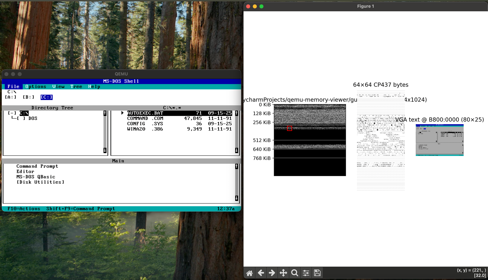

[](https://pypi.org/project/qemu-memory-viewer/)
[](https://www.python.org/)
[](https://github.com/jlmcgraw/qemu-memory-viewer/actions/workflows/main.yml)
[](https://jlmcgraw.github.io/qemu-memory-viewer/)

# qemu-memory-viewer

_A vibe-coded attempt to dynamically display the contents of RAM for running QEMU emulations with small amounts of memory.
I just thought it might be fun_

[]

## Super-quick Start
- install qemu
- Start the emulation

```commandline
./start_qemu_and_viewer.sh
```

## Documentation

The complete documentation can be found at the
[qemu-memory-viewer home page](https://jlmcgraw.github.io/qemu-memory-viewer)
